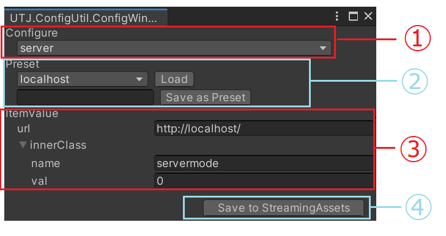

# UnityCofigUtil
Simple Configuration Tool

## enviroment
2019.3 ( exclude WebGL.because this depends on StreamingAssets....)

## define config data
```
using UTJ.ConfigUtil;

/** arg0 : Config name*/
[ConfigUtility("server")]
public class ConfigServer
{
    public string url;
    public ClassData innerClass;
}

[System.Serializable]
public class ClassData
{
    public string name;
    public int val;
}
```
## edit config window
Select Tools->Config


1.Select config type<br/>
2.Also you can save the data as preset.<br />
3.Edit data area<br />
4.Save to StreamingAssetsPath. <br/>


## How to load
```
var config = UTJ.ConfigUtil.ConfigLoader.LoadDatas<ConfigServer>();
```
